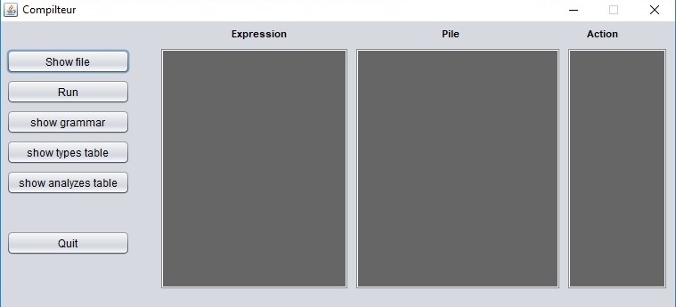
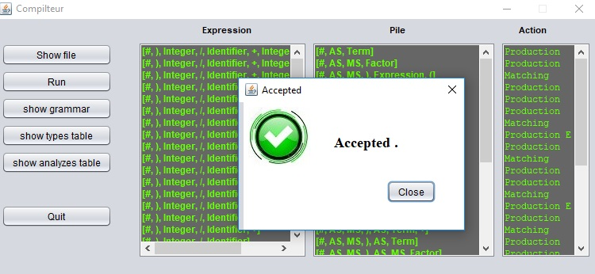

# about
 *this is a Top-Down parser build from scratch* 

## required
 * Netbeans IDE >=8 .
 * compilation
## utilization 

1. run the file with NetbeansIDE

   

2. press **show file ** and put your sentence 
3. press **run** 

   

